<div align="center">

# 👋 Hey, I'm Dheeraj

### Founder & CEO @ XAGI Labs

**Building the accountability layer for autonomous AI.**

<br/>

[](https://xagilab.com)
[](https://github.com/XAGI-Lab/melra)
[](https://github.com/dheeraj-codingdesk)

<br/>


</div>

---

# 🧠 About Me

```text
Founder by accident.
Builder by obsession.
Currently trying to make autonomous AI slightly less terrifying.
```

I'm **Dheeraj**, Founder & CEO of **XAGI Labs**, a frontier AI research lab building the infrastructure that lets companies give AI agents real power without giving up control or accountability.

We are working on a pretty important problem:

> 🔐 **What is this AI allowed to do?**  
> 📜 **What did it actually do?**  
> 📊 **How much autonomy should we trust it with next time?**

Because giving an AI browser access, terminals, APIs, company databases and money while relying on:

```text
"Hopefully it behaves."
```

...is probably not the peak of systems engineering.

---

# 🚀 What I'm Building

## 🧠 XAGI Labs

**XAGI Labs is building the accountability layer for autonomous AI.**

We sit between AI agents and the real systems they interact with.

```text
                ┌──────────────────┐
                │     AI AGENT     │
                └────────┬─────────┘
                         │
                         ▼
        ┌─────────────────────────────────┐
        │            XAGI LAYER           │
        │                                 │
        │  🔐 Permissions                 │
        │  🛡️ Policies                    │
        │  ⚙️ Execution Controls          │
        │  🧠 Context & Memory             │
        │  📜 Evidence                     │
        │  📊 Trust / Autonomy Rating      │
        └───────────────┬─────────────────┘
                        │
                        ▼
        ┌─────────────────────────────────┐
        │         REAL SYSTEMS            │
        │                                 │
        │ APIs • Browsers • Files         │
        │ Databases • Cloud • Payments    │
        │ Enterprise Software • Devices   │
        └─────────────────────────────────┘
```

The goal:

> **Give AI more autonomy without giving up accountability.**

Or, in a slightly more human analogy:

### A CIBIL score for AI.

The **limit, the record and the rating** for autonomous systems.

🌐 **Website:** [xagilab.com](https://xagilab.com)

---

## ⚙️ MELRA

### Kernel infrastructure for AI agents.

**MELRA** is part of our research into the execution layer underneath autonomous agents.

Instead of letting every agent directly poke around the operating system like an unsupervised intern with root access, MELRA provides infrastructure through which agents can interact with capabilities and systems.

Some of the areas we're working on include:

- 🧠 Persistent memory
- 🔎 Context retrieval
- ⚙️ Agent execution
- 🛠️ Tool invocation
- 🔐 Permissions
- 🧩 Multi-agent workflows
- 📜 Execution evidence
- 🖥️ Computer and system interaction

Think:

```text
Traditional Computer

Application
    ↓
Operating System
    ↓
Hardware
```

```text
Agentic Computer

AI Agent
    ↓
MELRA
    ↓
Tools / Systems / Computer
```

<div align="center">

[](https://github.com/XAGI-Lab/melra)

</div>

---

## 📊 TRUSCOR

Another part of our work asks a different question:

### How do you measure whether an AI agent deserves more autonomy?

TRUSCOR explores operational trust scoring for autonomous systems.

Rather than simply asking:

```text
"How intelligent is this model?"
```

we care about:

```text
"How safely and reliably does this system behave when it can actually do things?"
```

Because intelligence and trustworthiness are very much not the same variable.

Human history has already run that benchmark extensively.

---

# 🔬 Things I Obsess Over

```yaml
research_interests:
  - Autonomous AI Agents
  - Agent Operating Systems
  - AI Memory
  - Context Engineering
  - Multi-Agent Systems
  - AI Governance
  - AI Security
  - Agent Permissions
  - Tool Use
  - Computer Use
  - Distributed Systems
  - Cloud Infrastructure
  - Robotics
  - Human-AI Interaction
```

---

# 🧪 Research & Engineering


---

# 🕰️ Before XAGI

My startup career has mostly followed this sophisticated methodology:

```text
"Wouldn't it be cool if..."
          │
          ▼
       prototype
          │
          ▼
         users
          │
          ▼
 unexpected problems
          │
          ▼
       startup
```

Apparently that's entrepreneurship.

---

## 📱 Call Chat

One of my earliest products was **Call Chat**, a privacy-focused messaging platform I started building while still in school.

It eventually reached:

### 50,000+ users

The idea was simple:

> Private conversations shouldn't need to become somebody else's business model.

Server bills eventually had other philosophical opinions.

---

## 🛒 Easyfy

Then came **Easyfy**.

The idea was essentially:

### Swiggy-like delivery infrastructure for existing supermarkets.

Instead of creating dark stores, Easyfy worked around local supermarkets and attempted to bring their inventory and ordering online.

It taught me something important:

```text
Software:
"Everything is deterministic."

Logistics:
"That's adorable."
```

---

## 💻 Coding Desk

I started **Coding Desk** around the end of Class 10.

What began as a small software venture eventually became my first profitable business.

### 100+ clients served

across:

- Web development
- Applications
- SaaS platforms
- Automation
- Digital infrastructure

Coding Desk eventually became part of the journey that led to XAGI Labs.

<div align="center">

[](https://www.coding-desk.com/)

</div>

---

# 🤖 Robotics

I also build things that can physically move.

Because apparently letting the software remain inside the computer wasn't dangerous enough.

One of those experiments is **Lumo**, an emotionally intelligent robot designed around human interaction.

Areas I'm interested in include:

- 🤖 Agentic robotics
- 🧠 Emotion-aware AI
- 🎙️ Voice interfaces
- 👁️ Computer vision
- ⚡ Edge inference
- 🖥️ Human-computer interaction
- 🦾 Autonomous systems

The question that interests me isn't simply:

> Can AI think?

It's:

> **What happens when AI can think, remember, decide and act in the physical world?**

That's where things get considerably more interesting.

---

# 🎓 Somewhere Between All This...

I'm also studying **Data Science at IIT Madras**.

Currently exploring:

- Advanced AI architectures
- Neural reasoning
- AI memory
- Distributed computing
- Agent orchestration
- System architecture
- Robotics
- Research
- Music production
- Keyboard 🎹

My Chrome tab count is subject to an ongoing investigation.

---

# 🤝 I'm Interested in Collaborating On

- 🧠 Autonomous AI infrastructure
- ⚙️ Agent runtimes
- 🧩 Multi-agent systems
- 💾 Memory architectures
- 🔐 AI governance
- 🛡️ Agent security
- ☁️ Distributed AI
- 🖥️ Computer-use agents
- 🤖 Robotics
- 🌐 Open-source AI infrastructure
- 🧪 Experimental research
- 💡 Weird ideas that probably shouldn't work

Those last ones are usually the most interesting.

---

# 💬 Ask Me About


Or how to transform:

```text
"Wouldn't it be cool if..."
```

into:

```text
architecture.md

prototype_v2/
prototype_v7/
prototype_final/
prototype_final_v2/
prototype_final_ACTUAL/
prototype_final_ACTUAL_FIXED/
```

A universally respected software-development lifecycle.

---

# 💻 Tech Stack

## 👨‍💻 Languages


---

## 🌐 Frontend & App Development


---

## ⚙️ Backend & Infrastructure


---

## 🗄️ Databases


---

## ☁️ Cloud & Deployment


---

## 🤖 Hardware, Graphics & Design


---

# 📊 GitHub Stats

<div align="center">



<br/><br/>



<br/><br/>


</div>

---

# 🐍 Contribution Graph

<div align="center">

<picture>
  <source media="(prefers-color-scheme: dark)" srcset="https://raw.githubusercontent.com/dheeraj-codingdesk/dheeraj-codingdesk/output/github-contribution-grid-snake-dark.svg" />
  <source media="(prefers-color-scheme: light)" srcset="https://raw.githubusercontent.com/dheeraj-codingdesk/dheeraj-codingdesk/output/github-contribution-grid-snake.svg" />
  
</picture>

</div>

---

# 🌐 Connect With Me

<div align="center">

[](https://xagilab.com)

[](https://www.linkedin.com/in/dheeraj-s-307068359/)
[](https://x.com/Dhe_eraj_s)
[](https://www.instagram.com/dhee.raj_s/)
[](https://www.facebook.com/dhe_eraj_s/)
[](mailto:dheeraj@xagilab.com.com)

</div>

---

# ☕ Fuel the Experiments

If something I've built, researched, broken, rebuilt or open-sourced helped you:

<div align="center">

[](https://buymeacoffee.com/dhe_eraj_s)

</div>

No guarantees the coffee produces better code.

Historically, it mostly produces:

```text
more code
more tabs
more repositories
less sleep
```

---

# ⚡ Current Runtime

```python
class Dheeraj:

    def __init__(self):
        self.role = "Founder & CEO @ XAGI Labs"
        self.research = [
            "Autonomous Agents",
            "Agent Infrastructure",
            "AI Memory",
            "AI Governance",
            "Distributed Systems",
            "Robotics"
        ]
        self.current_mission = (
            "Give AI more autonomy "
            "without giving up accountability."
        )
        self.sleep_schedule = None

    def run(self):
        while True:
            research()
            build()
            break_something()
            understand_why()
            rebuild_better()
```

---

<div align="center">

# Where intelligence meets accountability.

### Building toward a world where AI can have more autonomy without humans giving up accountability.

<br/>

**Research • Build • Break • Understand • Repeat**

<br/>

[](https://github.com/dheeraj-codingdesk)

</div>
